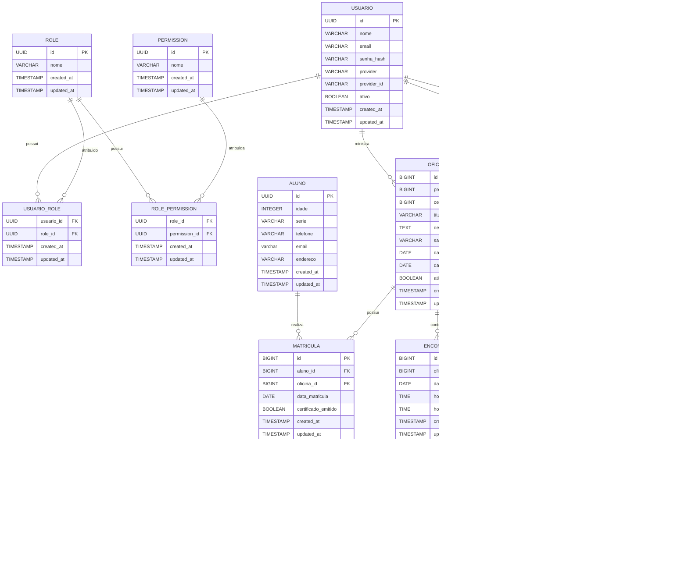

# Sistema de Gestão de Oficinas - Projeto ELLP

## Sobre o Projeto

O Sistema de Gestão de Oficinas do Projeto ELLP é uma aplicação web desenvolvida no contexto da disciplina de **Oficina de Integração 2** da **Universidade Tecnológica Federal do Paraná (UTFPR)**.

A proposta surgiu a partir de uma demanda apresentada pelo professor **Antonio Carlos Fernandes da Silva**, docente da UTFPR e coordenador do **ELLP (Espaço de Leitura, Letramento e Programação)**, que identificou a necessidade de informatizar o processo de gerenciamento das oficinas oferecidas pelo projeto.

Atualmente, atividades como cadastro de participantes, controle de frequência e emissão de certificados são realizadas de forma manual ou por meio de diferentes ferramentas, dificultando o acompanhamento das oficinas e aumentando a possibilidade de inconsistências nos dados.

O objetivo deste sistema é centralizar essas informações em uma única plataforma, permitindo o gerenciamento de alunos, voluntários, oficinas, encontros, frequência e certificados de participação.

---

# 1. Levantamento de Requisitos

## 1.1 Objetivo

Desenvolver um sistema web para apoiar a gestão das oficinas do Projeto ELLP, possibilitando o cadastro e gerenciamento de alunos, voluntários e oficinas, além do controle de frequência e emissão automatizada de certificados.

---

## 1.2 Requisitos Funcionais

| ID   | Nome                       | Descrição                                                                                                           | Prioridade | Dependências |
| ---- | -------------------------- | ------------------------------------------------------------------------------------------------------------------- | ---------- | ------------ |
| RF01 | Autenticação de Usuários   | Permitir autenticação por login tradicional (e-mail e senha) ou conta Google institucional.                         | Alta       | -            |
| RF02 | Gerenciamento de Usuários  | Permitir cadastro, consulta, edição e gerenciamento de permissões dos usuários do sistema.                          | Alta       | RF01         |
| RF03 | Cadastro de Alunos         | Permitir cadastrar, consultar, editar e remover alunos participantes das oficinas.                                  | Alta       | RF01         |
| RF04 | Cadastro de Voluntários    | Permitir cadastrar, consultar, editar e remover voluntários participantes do projeto.                               | Alta       | RF01         |
| RF05 | Cadastro de Oficinas       | Permitir cadastrar e gerenciar oficinas contendo título, descrição, professor responsável, sala, período e horário. | Alta       | RF01         |
| RF06 | Gerenciamento de Encontros | Permitir registrar os encontros pertencentes a uma oficina.                                                         | Alta       | RF05         |
| RF07 | Matrícula de Alunos        | Permitir matricular alunos em uma ou mais oficinas.                                                                 | Alta       | RF03, RF05   |
| RF08 | Vinculação de Voluntários  | Permitir associar voluntários às oficinas em que irão atuar.                                                        | Média      | RF04, RF05   |
| RF09 | Controle de Frequência     | Permitir registrar presença ou ausência dos alunos em cada encontro da oficina.                                     | Alta       | RF06, RF07   |
| RF10 | Cálculo de Frequência      | Calcular automaticamente o percentual de frequência dos alunos em cada oficina.                                     | Alta       | RF09         |
| RF11 | Emissão de Certificados    | Gerar certificados em PDF para alunos que atingirem frequência mínima de 75%.                                       | Alta       | RF10         |

---

## 1.3 Regras de Negócio

| ID   | Regra                                                                           |
| ---- | ------------------------------------------------------------------------------- |
| RN01 | Um aluno pode participar de várias oficinas simultaneamente.                    |
| RN02 | Uma oficina pode possuir vários alunos matriculados.                            |
| RN03 | Uma oficina pode possuir vários voluntários associados.                         |
| RN04 | A frequência deve ser calculada individualmente para cada oficina.              |
| RN05 | Apenas alunos com frequência igual ou superior a 75% podem receber certificado. |
| RN06 | Os certificados devem ser gerados em formato PDF.                               |

---

## 1.4 Requisitos Não Funcionais

| ID    | Nome                  | Descrição                                                                                                  |
| ----- | --------------------- | ---------------------------------------------------------------------------------------------------------- |
| RNF01 | Aplicação Web         | O sistema deverá ser acessível através de navegadores web modernos.                                        |
| RNF02 | Persistência de Dados | O sistema deverá armazenar as informações em banco de dados relacional.                                    |
| RNF03 | Controle de Acesso    | O sistema deverá exigir autenticação para acesso às funcionalidades protegidas.                            |
| RNF04 | Login Institucional   | O sistema deverá permitir autenticação utilizando contas Google institucionais.                            |
| RNF05 | Disponibilidade       | O sistema deverá permitir acesso simultâneo de múltiplos usuários sem comprometer a integridade dos dados. |

---

## 1.5 Principais Entidades do Sistema

### Usuário

Responsável por autenticação e acesso ao sistema.

**Atributos:**

* Nome
* E-mail
* Senha
* Perfil de acesso

### Aluno

Participante das oficinas ofertadas pelo Projeto ELLP.

**Atributos:**

* Nome
* Idade
* Série
* Telefone
* E-mail
* Endereço

### Voluntário

Participante responsável por auxiliar na realização das oficinas.

**Atributos:**

* Nome
* Telefone
* E-mail

### Oficina

Representa uma atividade ofertada pelo Projeto ELLP.

**Atributos:**

* Título
* Descrição
* Professor responsável
* Sala
* Horário
* Data de início
* Data de término

### Encontro

Representa uma ocorrência da oficina em uma data específica.

**Atributos:**

* Data
* Horário

### Frequência

Responsável pelo registro de presença dos alunos em cada encontro.

**Atributos:**

* Aluno
* Encontro
* Situação (Presente/Ausente)

### Certificado

Documento emitido para alunos que atingirem a frequência mínima exigida.

**Informações geradas:**

* Nome do aluno
* Nome da oficina
* Período de realização
* Data de emissão
* Identificação do Projeto ELLP

## 1.6 Modelo Lógico do Banco de Dados

O sistema foi modelado utilizando um banco de dados relacional, com foco em autenticação, autorização baseada em papéis (RBAC), gerenciamento de oficinas, matrículas, frequência, certificados e auditoria de ações.



## Controle de Acesso

O sistema utiliza um modelo RBAC (Role-Based Access Control), permitindo separar papéis de negócio das permissões do sistema.

### Roles previstas

* ADMIN
* VOLUNTARIO
* ALUNO

### Permissions previstas

#### Usuários

* CRIAR_USUARIO
* VISUALIZAR_USUARIO
* EDITAR_USUARIO

#### Alunos

* CRIAR_ALUNO
* VISUALIZAR_ALUNO
* EDITAR_ALUNO

#### Oficinas

* CRIAR_OFICINA
* VISUALIZAR_OFICINA
* EDITAR_OFICINA

#### Matrículas

* CRIAR_MATRICULA
* VISUALIZAR_MATRICULA
* EDITAR_MATRICULA

#### Frequências

* CRIAR_FREQUENCIA
* VISUALIZAR_FREQUENCIA
* EDITAR_FREQUENCIA

#### Certificados

* CRIAR_CERTIFICADO
* VISUALIZAR_CERTIFICADO
* EDITAR_CERTIFICADO
* EMITIR_CERTIFICADO

#### Auditoria

* VISUALIZAR_LOGS

---

## Tecnologias Planejadas

### Backend

* Kotlin
* Java 21
* Spring Boot 4.1.0
* Spring Web
* PostgreSQL Driver
* Flyway Migration
* Spring Security
* OAuth2 Client (Google Login)
* Validation
* JOOQ Access Layer
* Maven

### Banco de Dados

* PostgreSQL

### Frontend

* React 18
* Vite
* Tailwind CSS v4
* React Router DOM
* Axios

### Arquitetura

O projeto será organizado inicialmente em dois módulos:

```text
api/
└── Backend Kotlin + Spring Boot

web/
└── Frontend
```

A estrutura foi definida para permitir a separação clara entre backend e frontend, facilitando manutenção, testes automatizados e futuras evoluções do sistema.